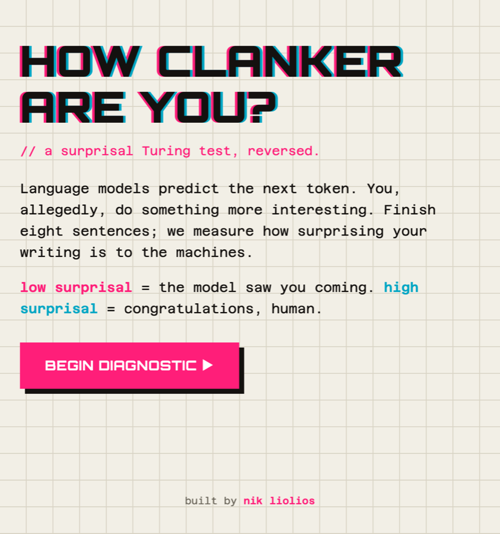
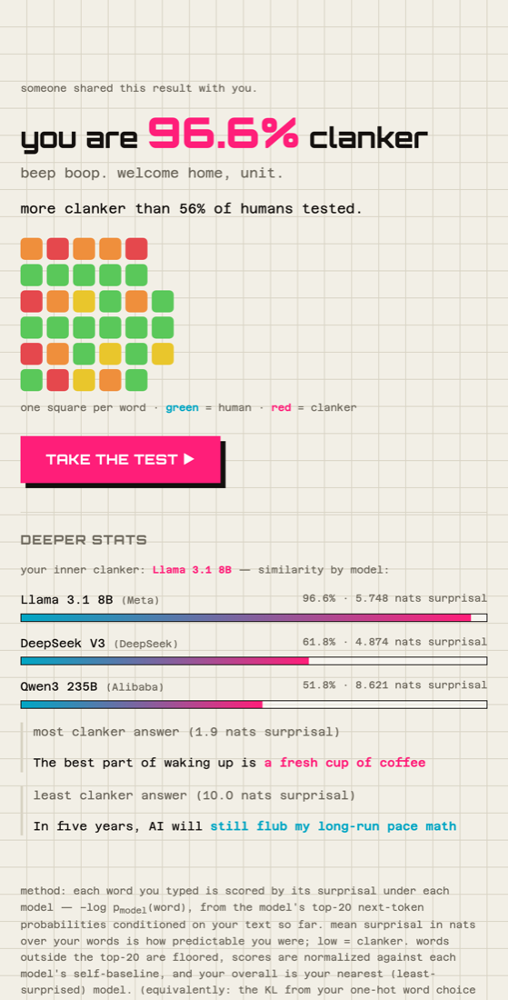

# how clanker are you?

**A reverse Turing test.** Finish a few sentences, and three language models
measure the **surprisal** of your writing — how well they predicted each word
you typed — then tell you how much clanker (robot) is in you.

**Live → [howclankerareyou.com](https://howclankerareyou.com)**

<a href="https://howclankerareyou.com"></a>

<a href="LICENSE"></a>

<table>
  <tr>
    <td width="50%"></td>
    <td width="50%"></td>
  </tr>
</table>

---

## The idea

Language models are next-token predictors. Give one a prefix and it returns a
probability distribution over what comes next. Each word you actually type has a
**surprisal** under that distribution — the standard psycholinguistics term for
how unexpected an observed event is:

```
surprisal(word) = −log p_model(word)
```

Average it over every word you typed and you get one number: how surprising your
writing is to a language model. **Low surprisal** means the model saw you coming
(**clanker**); **high surprisal** means you caught it off guard (**human**). It's
a Turing test pointed backwards — instead of asking a machine to imitate a human,
it asks how well a human imitates a machine.

> **Isn't this just perplexity / KL?** It's mean per-word surprisal, i.e.
> cross-entropy of your text under the model — the same family, named honestly.
> Your finished sentence is a sequence of one-hot next-word choices, and the KL
> divergence from each one-hot choice to the model's distribution collapses to
> exactly that word's surprisal. Calling the headline metric "KL divergence"
> would dress up per-word cross-entropy as a distance between two rich
> distributions, which it isn't — so the metric is surprisal, and this is the
> footnote.

## How the scoring actually works

The tricky part: turning free text into per-token surprisals without running a
tokenizer on either side. The Worker walks your completion greedily
([`src/scoring.js`](src/scoring.js)):

1. Ask the model for its **top-20 next tokens** given the prompt + your text so
   far, with logprobs.
2. Match the **longest candidate** that's a literal prefix of your remaining
   text; record its logprob.
3. Append *your* words to the running prefix and repeat.
4. Tokens outside the top-20 are **floored** just below the 20th candidate, so
   genuinely surprising words are penalized but not infinitely.

Every step is conditioned on what you actually wrote, and word boundaries are
the user's own — so the per-token logprobs also roll up into a **per-word
surprisal**, which drives the Wordle-style heat grid (green = human, red =
clanker) and its shareable emoji export.

## Calibration — the interesting failure

The naive anchor for "100% clanker" is a model's *own* output (it scores its own
text as maximally likely). But the panel is Llama / DeepSeek / Qwen, and most
people paste from **GPT or Claude** — whose text is foreign to all three. Early
on, ChatGPT completions scored a mushy ~54%.

The fix was to re-anchor the "100%" point to the *generic frontier-LLM* level
(each model's self-baseline **+ ~1.7 nats**, measured empirically), and steepen
the falloff. Now any-LLM paste lands ~100% and quirky human writing ~20%, with
the honest tradeoff that bland human prose lands mid-range — because bland prose
genuinely does read like an LLM.

## Architecture

```
browser ── howclankerareyou.com ── Cloudflare Worker ─┬─ static SPA (assets)
                                                       ├─ D1 (sessions, answers, results, usage)
                                                       └─ HF Inference Providers router
                                                            ├─ Llama 3.1 8B   (Meta)
                                                            ├─ DeepSeek V3     (DeepSeek)
                                                            └─ Qwen3 235B      (Alibaba)
```

- **Serverless, no build step, no framework.** Vanilla JS Worker + static
  assets. The whole app cold-starts at the edge.
- **Real logprobs** come from the HuggingFace Inference Providers router, each
  model pinned to a backend that returns top-20 logprobs and accepts an
  assistant-prefixed continuation. `src/mock.js` is a deterministic fallback so
  the site stays playable without credits.
- **Shareable results** persist in D1; anyone can open `/r/:id` to see a run,
  and the taker vs. shared-link views differ.

## Production concerns

- **Abuse guards:** per-IP rate limits on session creation and scoring
  (Cloudflare rate-limit bindings), plus a D1-counted **global daily call cap**
  as a backstop against distributed abuse that per-IP limits miss.
- **Cost:** a full 8-question run is ~99 model calls ≈ **$0.001** at current
  provider rates — ~1,800 runs on the platform's included monthly credit, with
  a hard spend ceiling (no pay-as-you-go attached).
- **Resilience:** when a Cloudflare Durable-Objects incident degraded the
  database's region, the D1 was migrated to a healthy region with a one-line
  config change (the app rebinds by name, no code change).
- **Analytics:** a private dashboard at `analytics.howclankerareyou.com`
  (host-routed in the same Worker, Google-OAuth gated to one email, D1 sessions)
  charts the funnel, virality loop, score distribution, and HF spend — all from
  the product tables plus a lightweight fire-and-forget events beacon. Charts are
  hand-rolled inline SVG; no build step, no chart library.

## Project layout

```
src/index.js      API: /api/session, /api/score, /api/finish, /api/result/:id, /api/status
src/scoring.js    greedy top-k matching, surprisal, per-word heat, calibrated score mapping
src/mock.js       deterministic stand-in for the logprobs endpoint
src/questions.js  server-side question bank
public/           landing → quiz → results SPA, favicon/OG/SEO assets
schema.sql        D1 tables
```

## Run it locally

```bash
npm install
printf 'MOCK_INFERENCE=1\n' > .dev.vars          # deterministic mock, no API key
npx wrangler d1 execute howclankerareyou-wnam --local --file schema.sql
npm run dev
```

For real inference, set `MOCK_INFERENCE=0` and add a HuggingFace token
(`HF_TOKEN=hf_…`) to `.dev.vars`.

## Notes & limitations

- Small open models can't perfectly separate careful human writing from LLM
  writing — the score is a fun signal, not a detector. Genuinely quirky answers
  are the reliable way to score low.
- The per-word heat grid uses each model's raw surprisal; the headline score is
  calibrated and takes the *nearest* (least-surprised) model.
- Adding an OpenAI/Anthropic model to the panel would tighten scoring for text
  pasted from those specific families, at the cost of a paid logprobs endpoint.

## License

MIT — see [LICENSE](LICENSE).
